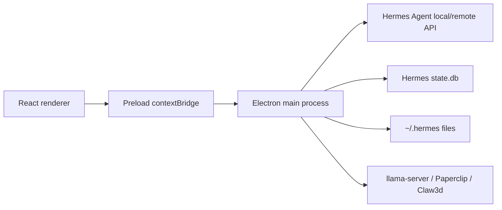

# Hermes Desktop Max


Hermes Desktop Max is Antman's fork of [Hermes Desktop](https://github.com/fathah/hermes-desktop), a native Electron app for installing, configuring, and chatting with [Hermes Agent](https://github.com/NousResearch/hermes-agent). The app provides a full desktop control surface for local or remote Hermes Agent usage: chat, sessions, models, profiles, memory, skills, tools, schedules, gateways, Office/Claw3d, Paperclip, settings, backup/import, and diagnostics.

This fork is currently aligned with upstream release `v0.5.2` and adds local model discovery and launch support for Antman's local model folders.

## Fork Highlights

- Scans local model files from:
  - `/Volumes/MainStore/Development/AI_Models`
  - `/Users/Antman/Desktop/AI_Models`
- Adds discovered `.gguf` and `.safetensors` files to the saved model library.
- Launches discovered `.gguf` models through local `llama-server` at `http://localhost:8080/v1`.
- Keeps `.safetensors` files discoverable while marking them non-launchable by the built-in llama.cpp launcher.
- Adds Paperclip sidecar configuration/status/start/stop/open support.
- Keeps OpenChronicle memory-provider wiring available through Hermes memory provider configuration.
- Includes Windows-oriented runtime path handling and installer support.
- Narrows packaged app files to built output/resources/package metadata to reduce package traversal and artifact size.

## Installers

Recent local unsigned installers were generated in:

- `/Users/Antman/Downloads/hermes-desktop-0.5.2-arm64.dmg`
- `/Users/Antman/Downloads/hermes-desktop-0.5.2-setup.exe`

Unsigned local builds may trigger macOS Gatekeeper or Windows SmartScreen warnings.

## Features

- Guided Hermes Agent install and update flow.
- Local, remote, and SSH connection modes.
- Streaming chat with tool progress, markdown, syntax highlighting, attachments, and session resume.
- Saved model CRUD with default, custom-provider, and local-file entries.
- Provider setup for hosted, local, and custom OpenAI-compatible endpoints.
- Profile isolation under `~/.hermes/profiles/<name>`.
- Memory entry editing, user profile editing, and provider discovery/configuration.
- Skill browsing, install, import, and uninstall workflows.
- Toolset enable/disable controls.
- Cron/schedule management with delivery targets.
- Messaging gateway configuration and process control.
- Hermes Office / Claw3d control panel.
- Paperclip sidecar management.
- Backup, import, debug dump, logs, diagnostics, and updater controls.

## Architecture



## Development

### Requirements

- Node.js/npm
- Git
- Python 3.11+ and `uv` for local Hermes Agent install flows
- Platform packaging tools when building native installers

### Setup

```bash
npm install
npm run typecheck
npm test
npm run dev
```

Use a temporary Hermes home for isolated development:

```bash
npm run dev:fresh
```

### Common Checks

```bash
npm run typecheck
npm test
npm run lint
```

### Build

```bash
npm run build
npm run build:mac
npm run build:win
npm run build:linux
```

For unsigned local macOS builds:

```bash
CSC_IDENTITY_AUTO_DISCOVERY=false electron-builder --mac dmg --arm64 --publish never -c.mac.notarize=false
```

## Documentation

The reconstruction and audit documentation requested for this fork lives in:

- [docs/project-reconstruction/INDEX.md](docs/project-reconstruction/INDEX.md)
- [docs/project-reconstruction/AI_REVIEW_PACK.md](docs/project-reconstruction/AI_REVIEW_PACK.md)
- [docs/project-reconstruction/TECHNOLOGY_AUDIT.md](docs/project-reconstruction/TECHNOLOGY_AUDIT.md)

Those documents are written to give another AI system enough context to recreate the project, audit its architecture, and identify improvement opportunities.

## Important Paths

- `src/main` - Electron main process modules and privileged operations.
- `src/preload` - typed bridge exposed to the renderer.
- `src/renderer/src` - React UI.
- `src/shared` - shared i18n and attachment types.
- `tests` - main/shared unit tests.
- `electron-builder.yml` - native packaging configuration.

## Attribution

This repository is a fork of the upstream [Hermes Desktop](https://github.com/fathah/hermes-desktop) project. Upstream design and Hermes Agent integration belong to the original project and contributors. This fork layers Antman's local model, memory, packaging, and Windows workflow improvements on top.

## License

MIT. See [LICENSE](LICENSE).
