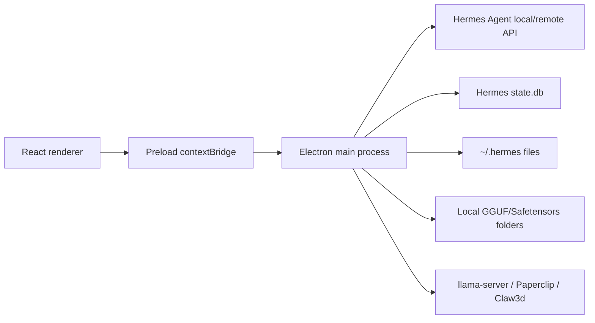

# Hermes Desktop Max

Hermes Desktop Max is Antman's maintained fork of
[Hermes Desktop](https://github.com/fathah/hermes-desktop), a native Electron
desktop application for installing, configuring, and operating
[Hermes Agent](https://github.com/NousResearch/hermes-agent). The application
provides a local desktop control plane for chat, sessions, model management,
profiles, memory, skills, tools, schedules, messaging gateways, Office/Claw3d,
Paperclip, diagnostics, and native packaging.

This fork is aligned with upstream version `0.5.2` and adds first-class local
model support for Antman's model folders plus a local macOS DMG build path.

## Fork Highlights

- Scans local model files from:
  - `/Volumes/MainStore/Development/AI_Models`
  - `/Users/Antman/Desktop/AI_Models`
- Adds discovered `.gguf` and `.safetensors` files to the saved model library.
- Skips tiny/incomplete local model files smaller than 1 MB and macOS `._*`
  AppleDouble sidecar files.
- Preserves previously discovered local models when an external drive is not
  mounted, but marks them unavailable instead of silently deleting them.
- Shows local model status in the Models screen: `Ready`, `Drive not mounted`,
  or `Missing file`.
- Prevents unavailable local models from being selected in Chat.
- Launches available `.gguf` models through local `llama-server` at
  `http://localhost:8080/v1`.
- Keeps `.safetensors` entries discoverable while marking them as manual-server
  models because the built-in launcher only starts GGUF files.
- Adds Paperclip sidecar configuration/status/start/stop/open support.
- Keeps OpenChronicle memory-provider wiring available through Hermes memory
  provider configuration.
- Includes Windows-oriented runtime path handling and installer support.
- Narrows packaged app files to built output/resources/package metadata to
  reduce package traversal and artifact size.

## Current macOS Build

The current local unsigned macOS build was generated at:

- `dist/hermes-desktop-max-0.5.2-arm64.dmg`
- `dist/mac-arm64/Hermes Desktop Max.app`

Install by opening the DMG and dragging `Hermes Desktop Max.app` into
Applications, or copy the app bundle directly:

```bash
cp -R "dist/mac-arm64/Hermes Desktop Max.app" /Applications/
```

The local build disables notarization with `-c.mac.notarize=false`. macOS may
ask for first-launch approval because this is a local unsigned/not-notarized
developer build.

## Features

- Guided Hermes Agent install and update flow.
- Local, remote, and SSH connection modes.
- Streaming chat with tool progress, markdown, syntax highlighting,
  attachments, media previews, and session resume.
- Saved model CRUD with default, custom-provider, and local-file entries.
- Provider setup for hosted, local, and custom OpenAI-compatible endpoints.
- Profile isolation under `~/.hermes/profiles/<name>`.
- Memory entry editing, user profile editing, and memory-provider discovery.
- Skill browsing, install, import, and uninstall workflows.
- Toolset enable/disable controls.
- Cron/schedule management with delivery targets.
- Messaging gateway configuration and process control.
- Hermes Office / Claw3d control panel.
- Paperclip sidecar management.
- Backup, import, debug dump, logs, diagnostics, and updater controls.

## Architecture



## Development

### Requirements

- Node.js and npm
- Git
- Python 3.11+ and `uv` for local Hermes Agent install flows
- `llama.cpp` when launching discovered GGUF files locally:

```bash
brew install llama.cpp
```

### Setup

```bash
npm install
npm run typecheck
npm test
npm run dev
```

Use a temporary Hermes home for isolated development:

```bash
npm run dev:fresh
```

### Common Checks

```bash
npm run typecheck
npm test
npm run lint
```

### Build

```bash
npm run build
npm run build:mac
npm run build:win
npm run build:linux
```

The macOS script currently builds an ARM64 DMG without publishing and without
notarization:

```bash
npm run build && electron-builder --mac dmg --arm64 --publish never -c.mac.notarize=false
```

For a fully ad-hoc unsigned local build that avoids automatic certificate
discovery, run:

```bash
CSC_IDENTITY_AUTO_DISCOVERY=false npm run build:mac
```

## Documentation

The reconstruction and audit documentation for this fork lives in:

- [docs/project-reconstruction/INDEX.md](docs/project-reconstruction/INDEX.md)
- [docs/project-reconstruction/AI_REVIEW_PACK.md](docs/project-reconstruction/AI_REVIEW_PACK.md)
- [docs/project-reconstruction/TECHNOLOGY_AUDIT.md](docs/project-reconstruction/TECHNOLOGY_AUDIT.md)

Documentation pack last regenerated: `2026-06-04`.

The same documentation pack is also copied outside the repo for local use at:

- `/Users/Antman/Desktop/Hermes_Desktop_Max/project-reconstruction-docs`
- `/Users/Antman/Desktop/Hermes_Desktop_Max/hermes-desktop-max-documentation-pack.zip`

## Important Paths

- `src/main` - Electron main process modules and privileged operations.
- `src/preload` - typed bridge exposed to the renderer.
- `src/renderer/src` - React UI.
- `src/shared` - shared i18n and attachment types.
- `tests` - main/shared/renderer unit and integration tests.
- `electron-builder.yml` - native packaging configuration.
- `docs/project-reconstruction` - complete project reconstruction docs.

## Local Model Behavior

Local model discovery is implemented in `src/main/local-model-files.ts`.
`listModels()` in `src/main/models.ts` reconciles discovered local files with
existing saved models. Newly discovered files are appended, existing local-file
entries are refreshed, and missing local-file entries are retained with
availability metadata:

- `available: false`
- `rootAvailable: false` when the configured drive/folder is not mounted
- `unavailableReason` explaining the missing drive or file

GGUF entries are launchable through `src/main/local-model-server.ts`. The
launcher rejects non-GGUF files, rejects paths outside configured model roots,
uses ports `8080` through `8099`, and reports a specific remediation message
when `llama-server` is not installed.

## Attribution

This repository is a fork of the upstream
[Hermes Desktop](https://github.com/fathah/hermes-desktop) project. Upstream
design and Hermes Agent integration belong to the original project and
contributors. This fork layers Antman's local model, memory, packaging, and
Windows workflow improvements on top.

## License

MIT. See [LICENSE](LICENSE).
