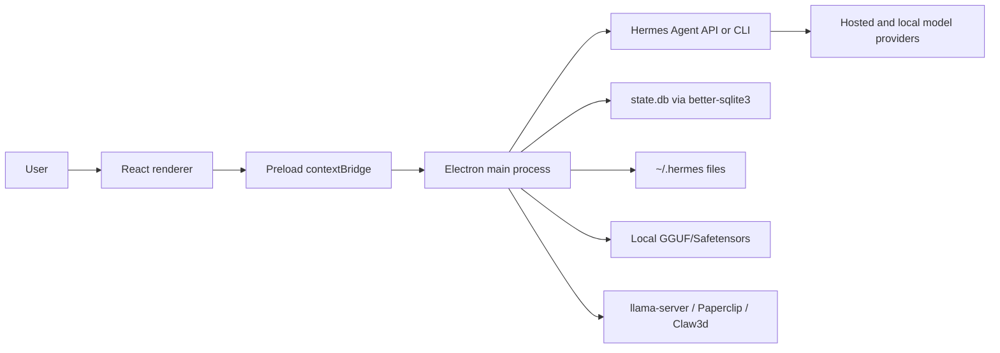

# Hermes Desktop Max

Hermes Desktop Max is Antman's maintained Electron desktop fork of
[Hermes Desktop](https://github.com/fathah/hermes-desktop). It is a native
macOS/Windows/Linux control plane for installing, configuring, and operating
[Hermes Agent](https://github.com/NousResearch/hermes-agent) with a strong
focus on local model workflows, profile-aware configuration, session history,
memory editing, skills, tools, schedules, messaging gateways, Paperclip,
Hermes Office/Claw3d, and desktop packaging.

This fork is aligned with application version `0.5.2` and publishes from
[`Antman1526/hermes-desktop-Max`](https://github.com/Antman1526/hermes-desktop-Max).

## What This Application Does

Hermes Desktop Max gives a user a single desktop interface for:

- Installing or adopting a Hermes Agent home under `~/.hermes`.
- Starting, stopping, testing, and configuring the Hermes Agent local gateway.
- Chatting with local, remote, SSH-tunneled, hosted, and custom
  OpenAI-compatible models.
- Discovering local model files from configured folders and adding them to the
  app's model picker.
- Launching local `.gguf` files through `llama-server` without requiring the
  user to run a model server manually.
- Managing providers, model defaults, API keys, credential pools, and custom
  provider base URLs.
- Browsing, resuming, searching, renaming, and deleting session history stored
  by Hermes Agent in SQLite.
- Editing memory files, user profile memory, SOUL.md, toolsets, skills, and
  schedules.
- Installing curated external skills, including Microsoft SkillOpt guidance for
  validation-gated improvement of Hermes skills.
- Managing sidecars including Paperclip and Hermes Office/Claw3d.
- Running backups, imports, doctor checks, updates, logs, and diagnostics from
  the desktop UI.

## Current Local Model Defaults

The primary local model root is:

```text
/Users/Antman/Desktop/AI_Models
```

The app recursively discovers launchable GGUF chat models under:

```text
/Users/Antman/Desktop/AI_Models/GGUF
```

The fallback root remains:

```text
/Volumes/MainStore/Development/AI_Models
```

Local file model discovery is implemented in
[`src/main/local-model-files.ts`](src/main/local-model-files.ts). The app:

- Recursively scans configured model roots.
- Accepts `.gguf` and `.safetensors`.
- Filters tiny files under `1 MiB`.
- Ignores macOS AppleDouble `._*` sidecar files.
- Filters embedding-only model names from the chat model picker.
- Marks missing external-drive models unavailable instead of deleting them.
- Sorts local-file entries by configured root priority, so Desktop models are
  shown before MainStore models.
- Marks `.gguf` files as launchable and `.safetensors` files as manual-server
  entries.

GGUF launch is implemented in
[`src/main/local-model-server.ts`](src/main/local-model-server.ts). The launcher:

- Uses `llama-server` from `/opt/homebrew/bin/llama-server`,
  `/usr/local/bin/llama-server`, or `PATH`.
- Starts at port `8080` and searches through `8099`.
- Serves OpenAI-compatible chat at `http://localhost:<port>/v1`.
- Uses `--ctx-size 16384`.
- Uses `--no-warmup` so large models do not block indefinitely on startup.
- Writes runtime state/logs under `~/.hermes`.

The currently validated default model config is:

```yaml
model:
  provider: "custom"
  default: "/Users/Antman/Desktop/AI_Models/GGUF/Phi-4-mini-instruct-Q4_K_M.gguf"
  base_url: "http://localhost:8081/v1"
```

The source default base URL for newly discovered local-file entries is
`http://localhost:8080/v1`; the running app updates `base_url` to the actual
available port returned by the launcher.

## Verified Desktop GGUF Models

The following application-level Electron IPC sweep was run against the Desktop
GGUF folder using the prompt:

```text
In one sentence, say what 7 + 5 equals and include the word HERMES.
```

All models answered through the app path:

| Model                                      | Result | Observed answer                                                                                                                   |
| ------------------------------------------ | ------ | --------------------------------------------------------------------------------------------------------------------------------- |
| `DeepSeek-R1-Distill-Qwen-14B-Q4_K_M.gguf` | Pass   | Hermes is the messenger who brings 7 + 5 to 12.                                                                                   |
| `gemma-4-12b-it-Q4_K_M.gguf`               | Pass   | Seven plus five equals twelve, a calculation even Hermes would know.                                                              |
| `gemma-4-E4B-it-Q4_K_M.gguf`               | Pass   | Seven plus five equals twelve, a number as swift as HERMES.                                                                       |
| `Llama-3.2-3B-Instruct-Q4_K_M.gguf`        | Pass   | As the messenger of the gods in Greek mythology, even the swift and wise HERMES couldn't help but calculate that 7 + 5 equals 12. |
| `Phi-4-mini-instruct-Q4_K_M.gguf`          | Pass   | HERMES says that 7 plus 5 equals 12.                                                                                              |
| `Qwen2.5-14B-Instruct-Q4_K_M.gguf`         | Pass   | HERMES would tell you that 7 + 5 equals 12.                                                                                       |
| `Qwen3.5-4B-Q4_K_M.gguf`                   | Pass   | 7 plus 5 equals 12, a fact that HERMES would certainly know.                                                                      |
| `Qwen3.5-9B-Q4_K_M.gguf`                   | Pass   | 7 + 5 equals 12, and HERMES is a luxury fashion brand.                                                                            |

## Architecture

Hermes Desktop Max is structured as a standard hardened Electron application:



Key layers:

- `src/main` contains privileged Electron code, IPC handlers, subprocess
  control, file-system access, SQLite reads, configuration writes, local model
  launch, and integration adapters.
- `src/preload` exposes a typed `window.hermesAPI` bridge to the renderer.
- `src/renderer/src` contains the React UI screens and hooks.
- `src/shared` contains cross-process attachment and i18n types/utilities.
- `tests` contains Vitest coverage for main, preload, shared, and renderer
  behavior.

## Important Runtime Paths

| Path                                     | Purpose                                                                       |
| ---------------------------------------- | ----------------------------------------------------------------------------- |
| `~/.hermes/config.yaml`                  | Active profile model/provider/tool configuration.                             |
| `~/.hermes/.env`                         | Active profile environment variables and provider keys.                       |
| `~/.hermes/desktop.json`                 | Desktop-only preferences: local model roots, connection mode, Paperclip, SSH. |
| `~/.hermes/models.json`                  | Saved model library, including discovered local-file entries.                 |
| `~/.hermes/state.db`                     | Hermes Agent SQLite session/message database.                                 |
| `~/.hermes/profiles/<name>`              | Isolated named profile home.                                                  |
| `~/.hermes/local-model-server.log`       | Desktop local model launcher log.                                             |
| `~/.hermes/local-model-server-llama.log` | Raw `llama-server` log.                                                       |

## Technology Stack

- TypeScript `5.9.3`
- Electron `39.8.5`
- electron-vite `5.0.0`
- Vite `7.3.1`
- React `19.2.4`
- React DOM `19.2.4`
- Tailwind CSS `4.2.2`
- better-sqlite3 `12.8.0`
- electron-builder `26.8.1`
- electron-updater `6.8.3`
- Vitest `4.1.4`
- Playwright `1.60.0`
- i18next `25.10.10`
- react-i18next `15.7.4`
- lucide-react `1.7.0`
- react-markdown `10.1.0`
- remark-gfm `4.0.1`
- highlight.js `11.11.1`
- react-syntax-highlighter `16.1.1`
- posthog-js `1.376.0`

Curated skill sources bundled with the app include Agent Skills, Taste Skill,
and Microsoft SkillOpt. SkillOpt is exposed in the Skills Browse tab as
`skill-optimization/skillopt` with docs and repository links.

For the exhaustive technology audit, see
[`docs/project-reconstruction/TECHNOLOGY_AUDIT.md`](docs/project-reconstruction/TECHNOLOGY_AUDIT.md).

## Development Requirements

Required:

- Node.js `22.x` recommended.
- npm with `package-lock.json`.
- Git.
- Python `3.11+` and `uv` for Hermes Agent local install/update flows.
- macOS for producing a macOS DMG.

Recommended for Desktop GGUF use:

```bash
brew install llama.cpp
```

The app expects a `llama-server` binary to be available from Homebrew or `PATH`.

## Setup

```bash
git clone https://github.com/Antman1526/hermes-desktop-Max.git
cd hermes-desktop-Max
npm install
npm run typecheck
npm test
npm run dev
```

Use a disposable Hermes home for isolated development:

```bash
npm run dev:fresh
```

## Commands

| Command               | Description                                               |
| --------------------- | --------------------------------------------------------- |
| `npm run dev`         | Start Electron/Vite development runtime.                  |
| `npm run dev:fresh`   | Start development runtime with a temporary `HERMES_HOME`. |
| `npm run start`       | Preview built Electron app.                               |
| `npm run typecheck`   | Run node/preload and renderer TypeScript checks.          |
| `npm test`            | Run Vitest suite.                                         |
| `npm run lint`        | Run ESLint cache.                                         |
| `npm run build`       | Typecheck and build main/preload/renderer bundles.        |
| `npm run build:mac`   | Build unsigned local ARM64 macOS DMG.                     |
| `npm run build:win`   | Build Windows NSIS and portable artifacts.                |
| `npm run build:linux` | Build Linux AppImage, Snap, Deb, RPM.                     |
| `npm run build:rpm`   | Build Linux RPM only.                                     |

## macOS DMG Build

Local unsigned DMG build:

```bash
CSC_IDENTITY_AUTO_DISCOVERY=false npm run build:mac
```

The app uses `electron-builder.yml` with:

- `appId: com.antman.hermes-desktop-max`
- `productName: Hermes Desktop Max`
- mac artifact name: `hermes-desktop-max-${version}-${arch}.${ext}`
- local notarization disabled with `-c.mac.notarize=false`
- signing identity disabled for local builds with `identity: null`

The expected ARM64 DMG is:

```text
dist/hermes-desktop-max-0.5.2-arm64.dmg
```

The app bundle is:

```text
dist/mac-arm64/Hermes Desktop Max.app
```

Install by opening the DMG and dragging the app into Applications. Because this
is a local unsigned/not-notarized developer build, macOS may require first
launch approval in System Settings.

## Testing

Run the standard verification suite:

```bash
npm run typecheck
npm test
npm run build
```

Current known-good verification:

- `npm run build:mac` completed TypeScript, Vite, and electron-builder DMG
  packaging locally.
- `npm test` passed `72` test files with `795` passing tests and `3` skipped.
- Desktop GGUF app-level model sweep passed `8/8` models.

## Documentation Pack

The reconstruction documentation lives in:

- [`docs/project-reconstruction/INDEX.md`](docs/project-reconstruction/INDEX.md)
- [`docs/project-reconstruction/AI_REVIEW_PACK.md`](docs/project-reconstruction/AI_REVIEW_PACK.md)
- [`docs/project-reconstruction/TECHNOLOGY_AUDIT.md`](docs/project-reconstruction/TECHNOLOGY_AUDIT.md)
- [`docs/project-reconstruction/01-project-overview-architecture.md`](docs/project-reconstruction/01-project-overview-architecture.md)
- [`docs/project-reconstruction/02-environment-setup-dependencies.md`](docs/project-reconstruction/02-environment-setup-dependencies.md)
- [`docs/project-reconstruction/03-database-schema-data-models.md`](docs/project-reconstruction/03-database-schema-data-models.md)
- [`docs/project-reconstruction/04-backend-api-specifications.md`](docs/project-reconstruction/04-backend-api-specifications.md)
- [`docs/project-reconstruction/05-frontend-architecture-components.md`](docs/project-reconstruction/05-frontend-architecture-components.md)
- [`docs/project-reconstruction/06-authentication-authorization.md`](docs/project-reconstruction/06-authentication-authorization.md)
- [`docs/project-reconstruction/07-business-logic-core-algorithms.md`](docs/project-reconstruction/07-business-logic-core-algorithms.md)
- [`docs/project-reconstruction/08-integrations-external-services.md`](docs/project-reconstruction/08-integrations-external-services.md)
- [`docs/project-reconstruction/09-configuration-environment.md`](docs/project-reconstruction/09-configuration-environment.md)
- [`docs/project-reconstruction/10-testing-strategy-test-cases.md`](docs/project-reconstruction/10-testing-strategy-test-cases.md)
- [`docs/project-reconstruction/11-build-deployment-pipeline.md`](docs/project-reconstruction/11-build-deployment-pipeline.md)
- [`docs/project-reconstruction/12-error-handling-logging.md`](docs/project-reconstruction/12-error-handling-logging.md)
- [`docs/project-reconstruction/13-performance-caching-optimization.md`](docs/project-reconstruction/13-performance-caching-optimization.md)
- [`docs/project-reconstruction/14-security-implementation-best-practices.md`](docs/project-reconstruction/14-security-implementation-best-practices.md)
- [`docs/project-reconstruction/15-file-structure-code-organization.md`](docs/project-reconstruction/15-file-structure-code-organization.md)

Documentation pack last regenerated: `2026-06-11`.

Local generated copies are placed under:

```text
/Users/Antman/Desktop/Hermes_Desktop_Max/project-reconstruction-docs
/Users/Antman/Desktop/Hermes_Desktop_Max/hermes-desktop-max-documentation-pack.zip
/Users/Antman/Desktop/Hermes_Desktop_Max/Hermes_Desktop_Max_TECHNOLOGY_AUDIT.md
```

## Security Model

- Renderer code does not get raw Node.js access.
- Privileged operations go through `window.hermesAPI` in preload.
- Main process owns filesystem, subprocess, shell, clipboard, dialog, update,
  and SQLite access.
- Remote API keys are not returned to the renderer; the renderer receives only
  `hasApiKey` and `apiKeyLength`.
- Environment variable names and values are validated before writing `.env`.
- External URL opening and webview URLs are allowlisted in `src/main/security.ts`.
- Local model launch is restricted to GGUF files discovered under configured
  roots.

## Known Pain Points

- `src/main/app-main.ts` is a large IPC registry and should eventually be split
  by domain.
- YAML handling is intentionally lightweight and should remain covered by tests
  if expanded.
- Local model startup time varies heavily by GGUF size and host memory.
- The app directly reads Hermes Agent `state.db` schema without owning the
  upstream migrations, so schema drift must be watched.
- The release workflow still contains some upstream naming assumptions that
  should be checked before public releases.

## Attribution

This repository is a fork of
[fathah/hermes-desktop](https://github.com/fathah/hermes-desktop). Upstream
architecture and Hermes Agent integration belong to the original project and
contributors. This fork layers Antman's local model defaults, Desktop GGUF
validation, local model launcher hardening, documentation, and packaging
workflow on top.

## License

MIT. See [`LICENSE`](LICENSE).
