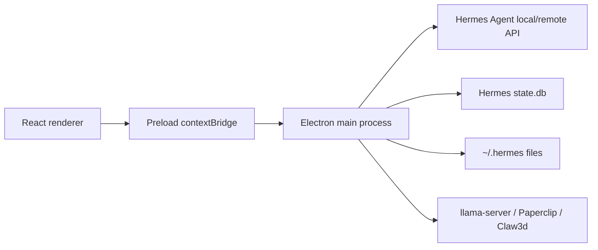

# Hermes Desktop Max


Hermes Desktop Max is Antman's fork of [Hermes Desktop](https://github.com/fathah/hermes-desktop), a native Electron app for installing, configuring, and chatting with [Hermes Agent](https://github.com/NousResearch/hermes-agent). The app provides a full desktop control surface for local or remote Hermes Agent usage: chat, sessions, models, profiles, memory, skills, tools, schedules, gateways, Office/Claw3d, Paperclip, settings, backup/import, and diagnostics.

This fork is currently aligned with upstream release `v0.5.2` and adds local model discovery and launch support for Antman's local model folders.

## Technology Stack

- **Desktop runtime:** Electron `^39.2.6`.
- **Build system:** electron-vite `^5.0.0`, Vite `^7.2.6`, TypeScript `^5.9.3`.
- **UI:** React `^19.2.1`, React DOM `^19.2.1`, CSS in `src/renderer/src/assets/main.css`, lucide-react icons.
- **Main-process storage access:** `better-sqlite3` `^12.8.0` for read access to Hermes Agent `state.db`.
- **Localization:** i18next and react-i18next.
- **Markdown/chat rendering:** react-markdown, remark-gfm, highlight.js, react-syntax-highlighter.
- **Packaging:** electron-builder `^26.0.12` for DMG, NSIS setup EXE, portable EXE, AppImage, snap, deb, and rpm targets.
- **Testing:** Vitest, jsdom, Testing Library, Playwright support scripts.
- **Backend dependency:** Hermes Agent is installed/adopted under `~/.hermes` and is controlled through local CLI commands, a local API server, remote HTTP mode, or SSH tunnel mode.

## Fork Highlights

- Scans local model files from:
  - `/Users/Antman/Desktop/AI_Models` (primary local/default root)
  - `/Volumes/MainStore/Development/AI_Models` (fallback external-drive root)
- Prioritizes launchable Desktop GGUF files under `/Users/Antman/Desktop/AI_Models/GGUF` when no model has been configured yet.
- Validates local model launch requests so only discovered GGUF files under configured model roots can start `llama-server`.
- Adds discovered `.gguf` and `.safetensors` files to the saved model library.
- Launches discovered `.gguf` models through local `llama-server`, starting at `http://localhost:8080/v1` and searching through `8099` when ports are occupied.
- Keeps `.safetensors` files discoverable while marking them non-launchable by the built-in llama.cpp launcher.
- Adds Paperclip sidecar configuration/status/start/stop/open support.
- Keeps OpenChronicle memory-provider wiring available through Hermes memory provider configuration.
- Includes Windows-oriented runtime path handling and installer support.
- Narrows packaged app files to built output/resources/package metadata to reduce package traversal and artifact size.

## Runtime Modes

Hermes Desktop Max supports three connection modes stored in `~/.hermes/desktop.json`.

| Mode | Backend path | What works |
| --- | --- | --- |
| `local` | Desktop launches and manages local Hermes Agent processes under `~/.hermes`. | Full feature set, including files, profiles, skills, sessions, local models, gateway, schedules, Paperclip, and Claw3d. |
| `remote` | Desktop talks to a remote Hermes API URL with an optional bearer key. | Chat and API-backed features. File-system-only screens are disabled or read-only where no remote API exists. |
| `ssh` | Desktop opens an SSH tunnel and executes remote Hermes CLI/file operations over SSH. | Intended to preserve local-mode feature parity on a remote host, including profiles, skills, memory, models, sessions, and Kanban where supported. |

The renderer never imports Node or Electron directly. Privileged operations flow through `src/preload/index.ts`, which exposes `window.hermesAPI`, and `src/main/app-main.ts`, which registers the corresponding `ipcMain.handle(...)` handlers.

## Installers

Recent local unsigned installers were generated in:

- `/Users/Antman/Downloads/hermes-desktop-max-0.5.2-arm64.dmg`
- `/Users/Antman/Downloads/hermes-desktop-0.5.2-setup.exe`
- `/Users/Antman/Downloads/hermes-desktop-0.5.2-portable.exe`

Unsigned local builds may trigger macOS Gatekeeper or Windows SmartScreen warnings.

## Features

- Guided Hermes Agent install and update flow.
- Local, remote, and SSH connection modes.
- Streaming chat with tool progress, markdown, syntax highlighting, attachments, and session resume.
- Saved model CRUD with default, custom-provider, and local-file entries.
- Provider setup for hosted, local, and custom OpenAI-compatible endpoints.
- Profile isolation under `~/.hermes/profiles/<name>`.
- Memory entry editing, user profile editing, and provider discovery/configuration.
- Skill browsing, install, import, and uninstall workflows.
- Toolset enable/disable controls.
- Cron/schedule management with delivery targets.
- Messaging gateway configuration and process control.
- Hermes Office / Claw3d control panel.
- Paperclip sidecar management.
- Backup, import, debug dump, logs, diagnostics, and updater controls.

## Core Data Locations

Default local install paths:

```text
~/.hermes/
~/.hermes/config.yaml
~/.hermes/.env
~/.hermes/desktop.json
~/.hermes/models.json
~/.hermes/state.db
~/.hermes/desktop/sessions.json
~/.hermes/profiles/<profile>/
```

Important desktop state files:

- `desktop.json` stores connection mode, remote URL, SSH config, local model roots, and desktop-specific sidecar settings.
- `models.json` stores saved default, custom-provider, and local-file model entries.
- `desktop/sessions.json` caches session summaries from Hermes Agent `state.db` for fast renderer reads.
- `local-model-scan.json` stores the latest local model root scan result.
- `local-model-server.pid`, `local-model-server-model`, `local-model-server-port`, and `local-model-server.log` track managed `llama-server` state.

Named profiles live under `~/.hermes/profiles/<profile>` and have their own config/env/memory/skills/session-cache paths.

## Architecture



Key implementation modules:

- `src/main/index.ts` bootstraps Electron main and imports `app-main`.
- `src/main/app-main.ts` owns BrowserWindow creation, menu setup, updater wiring, and IPC registration.
- `src/main/hermes.ts` starts/stops the Hermes gateway, routes chat requests, streams SSE chunks, and handles remote/SSH URL behavior.
- `src/main/config.ts` reads/writes `desktop.json`, `.env`, and YAML config values.
- `src/main/models.ts`, `src/main/local-model-files.ts`, and `src/main/local-model-server.ts` implement model registry, GGUF/safetensors discovery, active default selection, and `llama-server` process control.
- `src/main/skills.ts` manages local/curated skill browsing and mandatory SkillOpt installation.
- `src/main/ssh-remote.ts` mirrors local feature operations over SSH.
- `src/main/session-cache.ts` reads Hermes `state.db` with `better-sqlite3` and writes profile-local session summary caches.
- `src/renderer/src/App.tsx` handles splash/install/setup/main routing.
- `src/renderer/src/screens/Layout/Layout.tsx` owns the persistent sidebar and feature pane mounting.
- `src/renderer/src/screens/Chat` contains chat state, IPC streaming hooks, model picker, attachments, session resume, and local commands.

## Local GGUF Model Behavior

The default model roots are defined in `src/main/config.ts`:

```ts
export const DEFAULT_LOCAL_MODEL_ROOTS = [
  join(homedir(), "Desktop", "AI_Models"),
  "/Volumes/MainStore/Development/AI_Models",
];
```

The scanner accepts `.gguf` and `.safetensors` files larger than 1 MiB, ignores `._*` macOS sidecar files, filters likely embedding-only model names, and turns each file into a saved model entry. GGUF files are launchable; safetensors files remain visible but require an external compatible server.

When no model is configured, the app selects the first available launchable GGUF from the primary Desktop root, preferring `/Users/Antman/Desktop/AI_Models/GGUF`. Launch requests are hardened so the renderer cannot ask the main process to start an arbitrary GGUF path outside configured/discovered roots.

The `llama-server` launcher:

- Looks for `/opt/homebrew/bin/llama-server`, `/usr/local/bin/llama-server`, then `PATH`.
- Starts at port `8080` and searches through `8099`.
- Uses `--host 127.0.0.1`, `--ctx-size 16384`, `--no-warmup`, and an alias equal to the model path.
- Saves the actual selected OpenAI-compatible base URL back into model config.
- Surfaces readiness in the chat model picker as `Starting`, `Ready`, or `Error`.

## SkillOpt Integration

Microsoft SkillOpt-inspired workflow guidance is bundled under:

```text
resources/curated-skills/skillopt/skills/skillopt/SKILL.md
```

The SkillOpt skill is mandatory for the sleep-cycle workflow. It is auto-seeded into local and SSH profiles, marked `required` in the skills UI, and cannot be uninstalled through local or remote-backed skill operations.

## Development

### Requirements

- Node.js/npm
- Git
- Python 3.11+ and `uv` for local Hermes Agent install flows
- Platform packaging tools when building native installers

### Setup

```bash
npm install
npm run typecheck
npm test
npm run dev
```

Use a temporary Hermes home for isolated development:

```bash
npm run dev:fresh
```

### Common Checks

```bash
npm run typecheck
npm test
npm run lint
```

### Build

```bash
npm run build
npm run build:mac
npm run build:win
npm run build:linux
```

For unsigned local macOS builds:

```bash
CSC_IDENTITY_AUTO_DISCOVERY=false electron-builder --mac dmg --arm64 --publish never -c.mac.notarize=false
```

Windows packaging from macOS uses electron-builder's Windows targets. This repository is configured for:

- NSIS setup: `hermes-desktop-0.5.2-setup.exe`
- Portable EXE: `hermes-desktop-0.5.2-portable.exe`

The DMG target is:

- macOS arm64 DMG: `hermes-desktop-max-0.5.2-arm64.dmg`

## Verification

Before publishing or packaging, run:

```bash
npm run lint
npm run typecheck
npm test
npm run build
npm audit --audit-level=moderate
```

Packaging verification used for local release artifacts:

```bash
CSC_IDENTITY_AUTO_DISCOVERY=false npm run build:mac
npm run build:win
hdiutil verify /Users/Antman/Downloads/hermes-desktop-max-0.5.2-arm64.dmg
shasum -a 256 /Users/Antman/Downloads/hermes-desktop-max-0.5.2-arm64.dmg
```

## Documentation

The reconstruction and audit documentation requested for this fork lives in:

- [docs/project-reconstruction/INDEX.md](docs/project-reconstruction/INDEX.md)
- [docs/project-reconstruction/AI_REVIEW_PACK.md](docs/project-reconstruction/AI_REVIEW_PACK.md)
- [docs/project-reconstruction/TECHNOLOGY_AUDIT.md](docs/project-reconstruction/TECHNOLOGY_AUDIT.md)

Documentation pack last regenerated: `2026-06-12`.

Those documents are written to give another AI system enough context to recreate the project, audit its architecture, and identify improvement opportunities.

## Important Paths

- `src/main` - Electron main process modules and privileged operations.
- `src/preload` - typed bridge exposed to the renderer.
- `src/renderer/src` - React UI.
- `src/shared` - shared i18n and attachment types.
- `tests` - main/shared unit tests.
- `electron-builder.yml` - native packaging configuration.

## Attribution

This repository is a fork of the upstream [Hermes Desktop](https://github.com/fathah/hermes-desktop) project. Upstream design and Hermes Agent integration belong to the original project and contributors. This fork layers Antman's local model, memory, packaging, and Windows workflow improvements on top.

## License

MIT. See [LICENSE](LICENSE).
