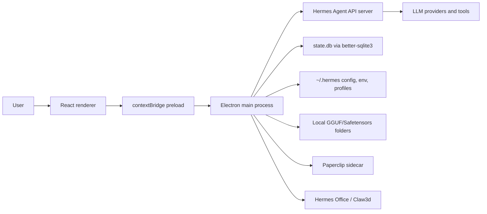

# 01 - Project Overview and Architecture

Generated from repository state on 2026-06-12. No secrets are included; environment-variable names are documented without values.

## Purpose

Hermes Desktop is an Electron desktop shell for installing, configuring, and operating Nous Research Hermes Agent. It wraps a local or remote Hermes API server with a React UI for chat, model selection, profiles, memory, skills, tools, schedules, gateways, Office/Claw3d, Paperclip, and diagnostics. This fork is version `0.5.2` and adds practical local model file discovery for:

- `/Volumes/MainStore/Development/AI_Models`
- `/Users/Antman/Desktop/AI_Models`

It also includes Windows-oriented runtime path handling, Paperclip sidecar controls, OpenChronicle memory-provider wiring, tighter installer packaging rules, and a local `llama-server` launcher for discovered `.gguf` model files.

## Runtime Topology

The application has four major runtime layers:

1. **Main process** - Electron lifecycle, BrowserWindow creation, IPC handlers, file-system access, subprocess orchestration, SQLite reads, updater control, and shell integration.
2. **Preload bridge** - exposes a typed `window.hermesAPI` and `window.electron` API to the renderer using `contextBridge` while keeping Node APIs out of the renderer.
3. **Renderer** - React 19 UI rendered by Vite. Screens use `window.hermesAPI` for all privileged operations.
4. **Hermes Agent backend** - local process under `HERMES_HOME` or a remote/SSH URL. Chat uses OpenAI-compatible HTTP/SSE endpoints.

## Architecture Diagram



## Main Process Composition

The main process imports each domain module and registers IPC handlers centrally in `src/main/index.ts`. That is intentionally simple to trace, but it makes the file large and creates a high-change hot spot.

```ts
   1 | import { appendFileSync, mkdirSync } from "fs";
   2 | import { dirname, join } from "path";
   3 |
   4 | function formatDetail(detail: unknown): string {
   5 |   if (detail === undefined) return "";
   6 |   if (detail instanceof Error) return ` ${detail.stack || detail.message}`;
   7 |   if (typeof detail === "string") return ` ${detail}`;
   8 |
   9 |   try {
  10 |     return ` ${JSON.stringify(detail)}`;
  11 |   } catch {
  12 |     return ` ${String(detail)}`;
  13 |   }
  14 | }
  15 |
  16 | function logBootstrap(event: string, detail?: unknown): void {
  17 |   const fallbackHome = process.env.HOME || process.cwd();
  18 |   const logPath =
  19 |     process.env.HERMES_STARTUP_LOG ||
  20 |     join(fallbackHome, ".hermes", "hermes-desktop-startup.log");
  21 |   const line = `${new Date().toISOString()} pid=${process.pid} bootstrap ${event}${formatDetail(detail)}\n`;
  22 |
  23 |   try {
  24 |     mkdirSync(dirname(logPath), { recursive: true });
  25 |     appendFileSync(logPath, line);
  26 |   } catch {
  27 |     try {
  28 |       appendFileSync("/tmp/hermes-desktop-startup.log", line);
  29 |     } catch {
  30 |       // Startup diagnostics must never change app behavior.
  31 |     }
  32 |   }
  33 | }
  34 |
  35 | process.on("uncaughtException", (err) => {
  36 |   logBootstrap("uncaughtException", err);
  37 |   console.error("[BOOTSTRAP UNCAUGHT]", err);
  38 | });
  39 |
  40 | process.on("unhandledRejection", (reason) => {
  41 |   logBootstrap("unhandledRejection", reason);
  42 |   console.error("[BOOTSTRAP UNHANDLED REJECTION]", reason);
  43 | });
  44 |
  45 | logBootstrap("loading app-main", {
  46 |   argv: process.argv,
  47 |   execPath: process.execPath,
  48 |   resourcesPath: process.resourcesPath,
  49 |   versions: process.versions,
  50 | });
  51 |
  52 | void import("./app-main")
  53 |   .then(() => {
  54 |     logBootstrap("loaded app-main");
  55 |   })
  56 |   .catch((err) => {
  57 |     logBootstrap("app-main import failed", err);
  58 |     console.error("[BOOTSTRAP IMPORT FAILED]", err);
  59 |     throw err;
  60 |   });
  61 |
```

## App Window and Navigation Boundary

The Electron window is configured in the main process and protected by URL allowlists from `src/main/security.ts`. In development the renderer is loaded from `ELECTRON_RENDERER_URL`; in production it loads the built `out/renderer/index.html`.

```ts

```

## Main Design Decisions

- **Electron instead of a pure web app:** required because the app installs local tooling, manages child processes, reads local SQLite databases, stages attachments, launches local model servers, and signs/updates desktop packages.
- **Single IPC facade:** renderer code talks to `window.hermesAPI` rather than importing Electron or Node. This keeps UI code portable and keeps privileged effects auditable in main/preload.
- **Hermes-owned persistent state:** the desktop app stores desktop-specific state in `~/.hermes/desktop.json`, `~/.hermes/models.json`, profile folders, and `~/.hermes/desktop/sessions.json`. Conversation data remains in Hermes Agent's `state.db`.
- **OpenAI-compatible routing:** local/custom providers are normalized into `OPENAI_BASE_URL` and a resolved API key so Hermes Agent can use the OpenAI-compatible path.
- **Generated installers:** electron-builder is configured for macOS DMG, Windows NSIS/portable, Linux AppImage/Snap/Deb/RPM, and GitHub publishing.

## Rebuild Requirements

To recreate this project, implement:

- Electron main/preload/renderer build split with `electron-vite`.
- React screen modules under `src/renderer/src/screens`.
- Typed preload API matching `src/preload/index.ts` and ambient declarations in `src/preload/index.d.ts`.
- Hermes install, gateway, SSH, profile, memory, skill, model, session, scheduling, Paperclip, and Claw3d modules in `src/main`.
- Test coverage with Vitest/jsdom and explicit main-process unit tests.

## Areas for Review

- Should `src/main/index.ts` be split into per-domain IPC registration files to reduce merge conflicts and startup complexity?
- Should local model discovery support user-configurable roots instead of hard-coded fork-specific paths?
- Should the app introduce a schema layer for `desktop.json`, `models.json`, and profile config mutations?
