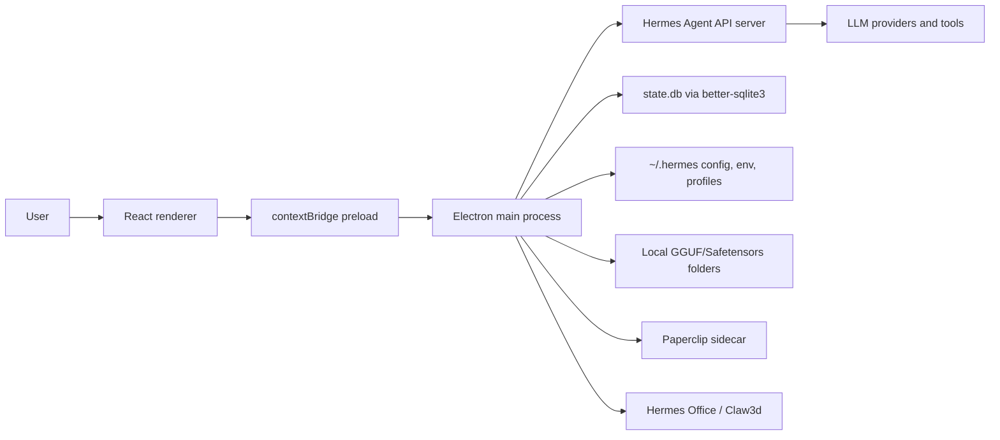

# 01 - Project Overview and Architecture

Generated from repository state on 2026-06-03. No secrets are included; environment-variable names are documented without values.

## Purpose

Hermes Desktop is an Electron desktop shell for installing, configuring, and operating Nous Research Hermes Agent. It wraps a local or remote Hermes API server with a React UI for chat, model selection, profiles, memory, skills, tools, schedules, gateways, Office/Claw3d, Paperclip, and diagnostics. This fork is version `0.5.2` and adds practical local model file discovery for:

- `/Volumes/MainStore/Development/AI_Models`
- `/Users/Antman/Desktop/AI_Models`

It also includes Windows-oriented runtime path handling, Paperclip sidecar controls, OpenChronicle memory-provider wiring, tighter installer packaging rules, and a local `llama-server` launcher for discovered `.gguf` model files.

## Runtime Topology

The application has four major runtime layers:

1. **Main process** - Electron lifecycle, BrowserWindow creation, IPC handlers, file-system access, subprocess orchestration, SQLite reads, updater control, and shell integration.
2. **Preload bridge** - exposes a typed `window.hermesAPI` and `window.electron` API to the renderer using `contextBridge` while keeping Node APIs out of the renderer.
3. **Renderer** - React 19 UI rendered by Vite. Screens use `window.hermesAPI` for all privileged operations.
4. **Hermes Agent backend** - local process under `HERMES_HOME` or a remote/SSH URL. Chat uses OpenAI-compatible HTTP/SSE endpoints.

## Architecture Diagram



## Main Process Composition

The main process imports each domain module and registers IPC handlers centrally in `src/main/index.ts`. That is intentionally simple to trace, but it makes the file large and creates a high-change hot spot.

```ts
   1 | import {
   2 |   app,
   3 |   shell,
   4 |   BrowserWindow,
   5 |   ipcMain,
   6 |   Menu,
   7 |   Notification,
   8 |   dialog,
   9 |   clipboard,
  10 | } from "electron";
  11 | import { join, extname } from "path";
  12 | import { readdir, readFile } from "fs/promises";
  13 | import { electronApp, optimizer, is } from "@electron-toolkit/utils";
  14 | import type { AppUpdater } from "electron-updater";
  15 | import icon from "../../resources/icon.png?asset";
  16 | import type { Attachment } from "../shared/attachments";
  17 | import { stageAttachment, clearStagedAttachments } from "./attachment-staging";
  18 | import { discoverProviderModels } from "./model-discovery";
  19 | import { readMediaAsDataUrl, saveMedia, mediaFileExists } from "./media";
  20 | import {
  21 |   checkInstallStatus,
  22 |   verifyInstall,
  23 |   runInstall,
  24 |   inspectInstallTarget,
  25 |   validateHermesHome,
  26 |   setHermesHomeOverride,
  27 |   getHermesVersion,
  28 |   clearVersionCache,
  29 |   runHermesDoctor,
  30 |   runHermesUpdate,
  31 |   checkOpenClawExists,
  32 |   runClawMigrate,
  33 |   runHermesBackup,
  34 |   runHermesImport,
  35 |   runHermesDump,
  36 |   listMcpServers,
  37 |   discoverMemoryProviders,
  38 |   configureMemoryProvider,
  39 |   readLogs,
  40 |   InstallProgress,
  41 | } from "./installer";
  42 | import { updaterLogger } from "./updater-log";
  43 | import {
  44 |   runHermesAuthLogin,
  45 |   cancelHermesAuthLogin,
  46 |   detectDeviceCode,
  47 | } from "./hermes-auth";
  48 | import {
  49 |   isRemoteMode,
  50 |   isRemoteOnlyMode,
  51 |   sendMessage,
  52 |   startGateway,
  53 |   stopGateway,
  54 |   isGatewayRunning,
  55 |   testRemoteConnection,
  56 |   stopHealthPolling,
  57 |   restartGateway,
  58 |   ensureSshTunnelIfNeeded,
  59 |   setSshRemoteApiKey,
  60 |   getRemoteAuthHeader,
  61 | } from "./hermes";
  62 | import {
  63 |   startSshTunnel,
  64 |   stopSshTunnel,
  65 |   testSshConnection,
  66 |   isSshTunnelActive,
  67 |   isSshTunnelHealthy,
  68 | } from "./ssh-tunnel";
  69 | import {
  70 |   getClaw3dStatus,
  71 |   setupClaw3d,
  72 |   startDevServer,
  73 |   stopDevServer,
  74 |   startAdapter,
  75 |   stopAdapter,
  76 |   startAll as startClaw3dAll,
  77 |   stopAll as stopClaw3d,
  78 |   getClaw3dLogs,
  79 |   setClaw3dPort,
  80 |   getClaw3dPort,
```

## App Window and Navigation Boundary

The Electron window is configured in the main process and protected by URL allowlists from `src/main/security.ts`. In development the renderer is loaded from `ELECTRON_RENDERER_URL`; in production it loads the built `out/renderer/index.html`.

```ts
 300 |   });
 301 |
 302 |   mainWindow.webContents.on(
 303 |     "console-message",
 304 |     (_event, level, message, line, sourceId) => {
 305 |       if (level >= 2) {
 306 |         console.error(`[RENDERER ERROR] ${message} (${sourceId}:${line})`);
 307 |       }
 308 |     },
 309 |   );
 310 |
 311 |   mainWindow.webContents.on(
 312 |     "did-fail-load",
 313 |     (_event, errorCode, errorDescription) => {
 314 |       console.error("[LOAD FAIL]", errorCode, errorDescription);
 315 |     },
 316 |   );
 317 |
 318 |   mainWindow.webContents.setWindowOpenHandler((details) => {
 319 |     openExternalUrl(details.url);
 320 |     return { action: "deny" };
 321 |   });
 322 |
 323 |   mainWindow.webContents.on("will-navigate", (event, url) => {
 324 |     if (
 325 |       isAllowedAppNavigationUrl(
 326 |         url,
 327 |         rendererHtmlPath,
 328 |         is.dev ? process.env["ELECTRON_RENDERER_URL"] : undefined,
 329 |       )
 330 |     ) {
 331 |       return;
 332 |     }
 333 |
 334 |     event.preventDefault();
 335 |     openExternalUrl(url);
 336 |   });
 337 |
 338 |   mainWindow.webContents.on(
 339 |     "will-attach-webview",
 340 |     (event, webPreferences, params) => {
 341 |       if (!isAllowedWebviewUrl(params.src)) {
 342 |         event.preventDefault();
 343 |         console.warn("[SECURITY] Blocked webview attachment for untrusted URL");
 344 |         return;
 345 |       }
 346 |
 347 |       hardenWebviewPreferences(webPreferences);
 348 |     },
 349 |   );
 350 |
 351 |   // Right-click context menu (issue #298): native Cut/Copy/Paste/Select All
 352 |   // via Electron roles — they act on the focused field / selection and work
 353 |   // across the whole app — plus two items to copy the whole conversation.
 354 |   mainWindow.webContents.on("context-menu", (_event, params) => {
 355 |     const { editFlags, isEditable } = params;
 356 |     const template: Electron.MenuItemConstructorOptions[] = [];
 357 |     if (isEditable) {
 358 |       template.push(
 359 |         { role: "cut", enabled: editFlags.canCut },
 360 |         { role: "copy", enabled: editFlags.canCopy },
```

## Main Design Decisions

- **Electron instead of a pure web app:** required because the app installs local tooling, manages child processes, reads local SQLite databases, stages attachments, launches local model servers, and signs/updates desktop packages.
- **Single IPC facade:** renderer code talks to `window.hermesAPI` rather than importing Electron or Node. This keeps UI code portable and keeps privileged effects auditable in main/preload.
- **Hermes-owned persistent state:** the desktop app stores desktop-specific state in `~/.hermes/desktop.json`, `~/.hermes/models.json`, profile folders, and `~/.hermes/desktop/sessions.json`. Conversation data remains in Hermes Agent's `state.db`.
- **OpenAI-compatible routing:** local/custom providers are normalized into `OPENAI_BASE_URL` and a resolved API key so Hermes Agent can use the OpenAI-compatible path.
- **Generated installers:** electron-builder is configured for macOS DMG, Windows NSIS/portable, Linux AppImage/Snap/Deb/RPM, and GitHub publishing.

## Rebuild Requirements

To recreate this project, implement:

- Electron main/preload/renderer build split with `electron-vite`.
- React screen modules under `src/renderer/src/screens`.
- Typed preload API matching `src/preload/index.ts` and ambient declarations in `src/preload/index.d.ts`.
- Hermes install, gateway, SSH, profile, memory, skill, model, session, scheduling, Paperclip, and Claw3d modules in `src/main`.
- Test coverage with Vitest/jsdom and explicit main-process unit tests.

## Areas for Review

- Should `src/main/index.ts` be split into per-domain IPC registration files to reduce merge conflicts and startup complexity?
- Should local model discovery support user-configurable roots instead of hard-coded fork-specific paths?
- Should the app introduce a schema layer for `desktop.json`, `models.json`, and profile config mutations?
