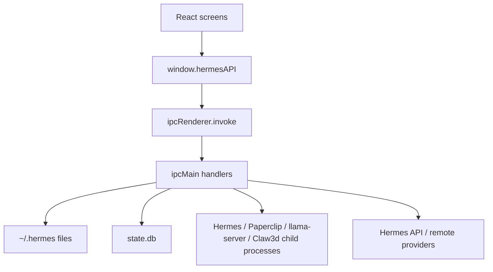

# Hermes Desktop Max - AI Review Pack

Generated from repository state on 2026-06-02. This condensed three-page pack is designed for another AI reviewer to quickly reason about optimization, refactoring, patterns, and architecture.

## Page 1 - Project Overview

Hermes Desktop Max is an Electron + React desktop application for installing and operating Hermes Agent. The app owns the GUI, local process orchestration, profile/config editing, sessions UI, model registry, local model discovery, and sidecar integrations. Hermes Agent remains the backend brain and stores conversation state in SQLite.

Core stack: Electron 39, electron-vite 5, Vite 7, React 19, TypeScript 5.9, Tailwind 4, better-sqlite3, Vitest 4, electron-builder 26. Runtime state lives mostly under `~/.hermes`.

High-level data flow:



Important trade-off: privileged work is centralized in the main process, which is easy to audit but has produced a very large `src/main/index.ts` IPC registry. Renderer code is mostly cleanly separated from Node access.

## Page 2 - Key Code Walkthrough

### Preload bridge

```ts
  35 | const hermesAPI = {
  36 |   // Installation
  37 |   checkInstall: (): Promise<{
  38 |     installed: boolean;
  39 |     configured: boolean;
  40 |     hasApiKey: boolean;
  41 |   }> => ipcRenderer.invoke("check-install"),
  42 | 
  43 |   verifyInstall: (): Promise<boolean> => ipcRenderer.invoke("verify-install"),
  44 | 
  45 |   startInstall: (): Promise<{ success: boolean; error?: string }> =>
  46 |     ipcRenderer.invoke("start-install"),
  47 | 
  48 |   // Pre-install inspection + "use an existing installation" (issue #272)
  49 |   inspectInstallTarget: (): Promise<{
  50 |     hermesHome: string;
  51 |     repoPath: string;
  52 |     state: "fresh" | "update" | "replace";
  53 |   }> => ipcRenderer.invoke("inspect-install-target"),
  54 | 
  55 |   validateHermesHome: (dir: string): Promise<boolean> =>
  56 |     ipcRenderer.invoke("validate-hermes-home", dir),
  57 | 
  58 |   adoptHermesHome: (dir: string): Promise<boolean> =>
  59 |     ipcRenderer.invoke("adopt-hermes-home", dir),
  60 | 
  61 |   quitApp: (): Promise<void> => ipcRenderer.invoke("quit-app"),
  62 | 
  63 |   onInstallProgress: (
  64 |     callback: (progress: {
  65 |       step: number;
  66 |       totalSteps: number;
  67 |       title: string;
  68 |       detail: string;
  69 |       log: string;
  70 |     }) => void,
```

Intent: expose a narrow API surface and keep Node/Electron objects out of React. Review concern: the surface is now very large and lacks runtime input validators.

### Local model discovery

```ts
   8 |   "/Volumes/MainStore/Development/AI_Models",
   9 |   join(homedir(), "Desktop", "AI_Models"),
  10 | ];
  11 | 
  12 | export interface LocalModelFile {
  13 |   path: string;
  14 |   root: string;
  15 |   format: "gguf" | "safetensors";
  16 | }
  17 | 
  18 | const SUPPORTED_FORMATS = new Set([".gguf", ".safetensors"]);
  19 | const DEFAULT_LOCAL_BASE_URL = "http://localhost:8080/v1";
  20 | 
  21 | function modelNameFromPath(path: string): string {
  22 |   const withoutExt = basename(path, extname(path));
  23 |   return (
  24 |     "Local " + withoutExt.replace(/[_-]+/g, " ").replace(/\s+/g, " ").trim()
  25 |   );
  26 | }
  27 | 
  28 | function stableLocalModelId(path: string): string {
  29 |   return `local-file-${createHash("sha1").update(path).digest("hex").slice(0, 16)}`;
  30 | }
  31 | 
  32 | export function discoverLocalModelFiles(
  33 |   roots: string[] = LOCAL_MODEL_ROOTS,
  34 | ): LocalModelFile[] {
  35 |   const found: LocalModelFile[] = [];
  36 | 
  37 |   function visit(root: string, dir: string): void {
  38 |     let entries;
  39 |     try {
  40 |       entries = readdirSync(dir, { withFileTypes: true }).sort((a, b) =>
  41 |         a.name.localeCompare(b.name),
  42 |       );
  43 |     } catch {
  44 |       return;
  45 |     }
  46 | 
  47 |     for (const entry of entries) {
  48 |       if (entry.name.startsWith("._")) continue;
  49 |       const entryPath = join(dir, entry.name);
  50 |       if (entry.isDirectory()) {
  51 |         visit(root, entryPath);
  52 |         continue;
  53 |       }
  54 |       if (!entry.isFile()) continue;
  55 | 
  56 |       const ext = extname(entry.name).toLowerCase();
  57 |       if (!SUPPORTED_FORMATS.has(ext)) continue;
  58 |       found.push({
  59 |         path: entryPath,
  60 |         root,
  61 |         format: ext.slice(1) as LocalModelFile["format"],
  62 |       });
  63 |     }
  64 |   }
  65 | 
  66 |   for (const root of roots) {
  67 |     if (existsSync(root)) visit(root, root);
  68 |   }
  69 | 
  70 |   return found;
  71 | }
  72 | 
  73 | export function buildLocalModelEntries(files: LocalModelFile[]): SavedModel[] {
  74 |   return files.map((file) => ({
  75 |     id: stableLocalModelId(file.path),
  76 |     name: modelNameFromPath(file.path),
  77 |     provider: "custom",
  78 |     model: file.path,
```

Intent: make Antman's local model folders first-class model options. Review concern: synchronous recursive scanning may block if external storage is slow.

### Safe local model launching

```ts
 126 |       },
 127 |     );
 128 |     req.on("error", () => resolve(false));
 129 |     req.on("timeout", () => {
 130 |       req.destroy();
 131 |       resolve(false);
 132 |     });
 133 |     req.end();
 134 |   });
 135 | }
 136 | 
 137 | export async function getLocalModelServerStatus(): Promise<LocalModelServerStatus> {
 138 |   const launcherPath = resolveLlamaServerCommand();
 139 |   const launcherAvailable = commandAvailable(launcherPath);
 140 |   const pid = readPid();
 141 |   const managed = Boolean(pid && pidIsAlive(pid));
 142 |   const running = managed || (await serverHealth());
 143 |   if (pid && !managed && !(await serverHealth())) clearStateFiles();
 144 | 
 145 |   return {
 146 |     running,
 147 |     managed,
 148 |     launcherAvailable,
 149 |     launcherPath: launcherAvailable ? launcherPath : null,
 150 |     modelPath: managed ? readModelPath() : null,
 151 |     baseUrl: LOCAL_MODEL_SERVER_BASE_URL,
 152 |     pid: managed ? pid : null,
 153 |   };
 154 | }
 155 | 
 156 | export async function startLocalModelServer(
 157 |   modelPath: string,
 158 | ): Promise<LocalModelServerStatus> {
 159 |   if (!isLaunchableLocalModel(modelPath)) {
 160 |     return {
 161 |       ...(await getLocalModelServerStatus()),
 162 |       error: "Only GGUF model files can be launched with llama-server.",
 163 |     };
 164 |   }
 165 |   if (!isDiscoveredLocalModelPath(modelPath)) {
 166 |     return {
 167 |       ...(await getLocalModelServerStatus()),
 168 |       error: "Model file is not in a configured local model folder.",
 169 |     };
 170 |   }
 171 |   if (!existsSync(modelPath)) {
 172 |     return {
 173 |       ...(await getLocalModelServerStatus()),
 174 |       error: `Model file does not exist: ${modelPath}`,
 175 |     };
 176 |   }
 177 | 
 178 |   const current = await getLocalModelServerStatus();
 179 |   if (current.running && current.modelPath === modelPath) return current;
 180 |   if (current.managed && current.modelPath !== modelPath) {
 181 |     stopLocalModelServer();
 182 |   }
 183 |
```

Intent: only launch discovered GGUF files through `llama-server`. Review concern: process lifecycle patterns are duplicated across several modules.

### Session cache

```ts
 104 |     const rows = db
 105 |       .prepare(
 106 |         `SELECT s.id, s.started_at, s.source, s.message_count, s.model, s.title
 107 |          FROM sessions s
 108 |          WHERE s.started_at > ?
 109 |          ORDER BY s.started_at DESC`,
 110 |       )
 111 |       .all(cache.lastSync > 0 ? cache.lastSync - 300 : 0) as Array<{
 112 |       id: string;
 113 |       started_at: number;
 114 |       source: string;
 115 |       message_count: number;
 116 |       model: string;
 117 |       title: string | null;
 118 |     }>;
 119 | 
 120 |     // Index existing sessions by id once so the per-row update below is
 121 |     // O(1) instead of O(N). Without this, syncing N existing sessions
 122 |     // against N new rows is O(N²) and visibly slows app startup once a
 123 |     // user has accumulated thousands of sessions (issue #16).
 124 |     const existingById = new Map<string, CachedSession>();
 125 |     for (const s of cache.sessions) existingById.set(s.id, s);
 126 |     const newSessions: CachedSession[] = [];
 127 | 
 128 |     const refreshedIds = new Set<string>();
 129 |     for (const row of rows) {
 130 |       refreshedIds.add(row.id);
 131 |       const existing = existingById.get(row.id);
 132 |       if (existing) {
 133 |         existing.messageCount = row.message_count;
 134 |         if (row.model) existing.model = row.model;
 135 |         if (row.title) existing.title = row.title;
 136 |         continue;
 137 |       }
 138 | 
 139 |       let title = row.title || "";
 140 |       if (!title) {
 141 |         try {
 142 |           const msg = db
 143 |             .prepare(
 144 |               `SELECT content FROM messages
 145 |                WHERE session_id = ? AND role = 'user' AND content IS NOT NULL
 146 |                ORDER BY timestamp, id LIMIT 1`,
 147 |             )
 148 |             .get(row.id) as { content: string } | undefined;
 149 |           title = msg
 150 |             ? generateTitle(msg.content)
 151 |             : t("sessions.newConversation", getAppLocale());
 152 |         } catch {
 153 |           title = t("sessions.newConversation", getAppLocale());
 154 |         }
 155 |       }
 156 | 
 157 |       newSessions.push({
 158 |         id: row.id,
 159 |         title,
 160 |         startedAt: row.started_at,
 161 |         source: row.source,
 162 |         messageCount: row.message_count,
 163 |         model: row.model || "",
 164 |       });
 165 |     }
 166 | 
 167 |     // Phase 2: refresh message_count for cached sessions that weren't
 168 |     // returned by the lastSync-windowed query above. Without this, an
 169 |     // old session that's still accumulating messages keeps the stale
 170 |     // count it had at first sync — the renderer reads from the cache,
 171 |     // so the UI reports e.g. 15 messages when the conversation actually
 172 |     // has 200+. Issue #226. Cheap (single column, no joins, batched IN
 173 |     // clause), and skipped entirely on a first sync since cache.sessions
 174 |     // is empty.
 175 |     const staleIds = cache.sessions
 176 |       .map((s) => s.id)
 177 |       .filter((id) => !refreshedIds.has(id));
 178 |     if (staleIds.length > 0) {
```

Intent: avoid startup/session-list slowdown with thousands of sessions. Review concern: cache invalidation is file-based and not schema-versioned.

## Page 3 - Dependencies, Pain Points, and Design Trade-Offs

Data dependencies:

- SQLite `state.db` tables `sessions`, `messages`, and optional `messages_fts`.
- JSON stores: `desktop.json`, `models.json`, `desktop/sessions.json`.
- YAML store: `config.yaml`.
- Profile env files containing provider/tool secrets.

Known limitations and technical debt:

- `src/main/index.ts` is a central IPC hot spot with many unrelated responsibilities.
- Provider/env-key mapping is duplicated across renderer constants, installer, setup/models screens, and chat routing.
- Secrets are stored in profile files rather than OS credential stores.
- Local model roots are hard-coded for this fork.
- Local model scanning is synchronous.
- Error payloads are inconsistent: boolean, null, throws, and `{ success, error }` all coexist.
- Electron-builder packaging can be slow if file globs include too much workspace content; current config narrows packaged files.

## Areas for Review

- What IPC handlers should be split into domain registrars first?
- How would you design a shared provider registry that covers UI labels, env keys, install gates, and runtime routing?
- Should local model folders be configurable in Settings, and how should the app cache scans?
- Which secrets should move to OS keychain first?
- What runtime validation library or pattern should guard the preload/main IPC boundary?
- Should session cache and desktop config files receive explicit schema versions and migrations?
