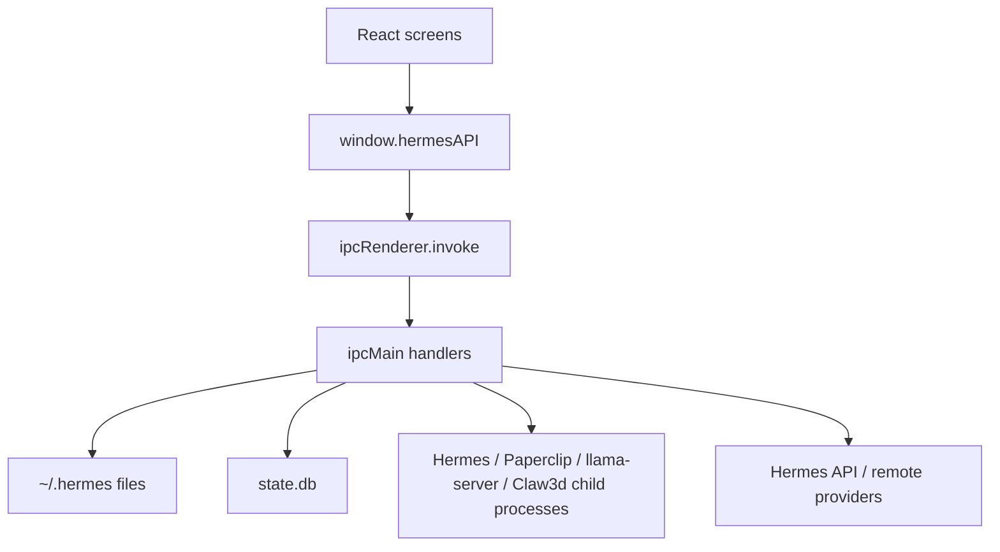

# Hermes Desktop Max - AI Review Pack

Generated from repository state on 2026-06-12. This condensed three-page pack is designed for another AI reviewer to quickly reason about optimization, refactoring, patterns, and architecture.

## Page 1 - Project Overview

Hermes Desktop Max is an Electron + React desktop application for installing and operating Hermes Agent. The app owns the GUI, local process orchestration, profile/config editing, sessions UI, model registry, local model discovery, and sidecar integrations. Hermes Agent remains the backend brain and stores conversation state in SQLite.

Core stack: Electron 39, electron-vite 5, Vite 7, React 19, TypeScript 5.9, Tailwind 4, better-sqlite3, Vitest 4, electron-builder 26. Runtime state lives mostly under `~/.hermes`.

High-level data flow:



Important trade-off: privileged work is centralized in the main process, which is easy to audit but has produced a very large `src/main/index.ts` IPC registry. Renderer code is mostly cleanly separated from Node access.

## Page 2 - Key Code Walkthrough

### Preload bridge

```ts
  35 | const hermesAPI = {
  36 |   // Installation
  37 |   checkInstall: (): Promise<{
  38 |     installed: boolean;
  39 |     configured: boolean;
  40 |     hasApiKey: boolean;
  41 |   }> => ipcRenderer.invoke("check-install"),
  42 |
  43 |   verifyInstall: (): Promise<boolean> => ipcRenderer.invoke("verify-install"),
  44 |
  45 |   startInstall: (): Promise<{ success: boolean; error?: string }> =>
  46 |     ipcRenderer.invoke("start-install"),
  47 |
  48 |   // Pre-install inspection + "use an existing installation" (issue #272)
  49 |   inspectInstallTarget: (): Promise<{
  50 |     hermesHome: string;
  51 |     repoPath: string;
  52 |     state: "fresh" | "update" | "replace";
  53 |   }> => ipcRenderer.invoke("inspect-install-target"),
  54 |
  55 |   validateHermesHome: (dir: string): Promise<boolean> =>
  56 |     ipcRenderer.invoke("validate-hermes-home", dir),
  57 |
  58 |   adoptHermesHome: (dir: string): Promise<boolean> =>
  59 |     ipcRenderer.invoke("adopt-hermes-home", dir),
  60 |
  61 |   quitApp: (): Promise<void> => ipcRenderer.invoke("quit-app"),
  62 |
  63 |   onInstallProgress: (
  64 |     callback: (progress: {
  65 |       step: number;
  66 |       totalSteps: number;
  67 |       title: string;
  68 |       detail: string;
  69 |       log: string;
  70 |     }) => void,
```

Intent: expose a narrow API surface and keep Node/Electron objects out of React. Review concern: the surface is now very large and lacks runtime input validators.

### Local model discovery

```ts
   8 |
   9 | export const LOCAL_MODEL_ROOTS = DEFAULT_LOCAL_MODEL_ROOTS;
  10 |
  11 | export interface LocalModelFile {
  12 |   path: string;
  13 |   root: string;
  14 |   format: "gguf" | "safetensors";
  15 |   size?: number;
  16 |   mtimeMs?: number;
  17 | }
  18 |
  19 | export interface LocalModelRootStatus {
  20 |   path: string;
  21 |   available: boolean;
  22 |   modelCount: number;
  23 | }
  24 |
  25 | export interface LocalModelScanStatus {
  26 |   createdAt: number;
  27 |   roots: LocalModelRootStatus[];
  28 |   files: LocalModelFile[];
  29 | }
  30 |
  31 | const SUPPORTED_FORMATS = new Set([".gguf", ".safetensors"]);
  32 | const DEFAULT_LOCAL_BASE_URL = "http://localhost:8080/v1";
  33 | const MIN_LOCAL_MODEL_BYTES = 1 * 1024 * 1024;
  34 | const LOCAL_MODEL_SCAN_CACHE_FILE = join(HERMES_HOME, "local-model-scan.json");
  35 | const NON_CHAT_MODEL_NAME_PATTERNS = [
  36 |   /\bembed(?:ding)?s?\b/i,
  37 |   /\bnomic[-_. ]?embed\b/i,
  38 |   /\bbge[-_. ]/i,
  39 |   /\be5[-_. ]/i,
  40 |   /\bgte[-_. ]/i,
  41 | ];
  42 |
  43 | function modelNameFromPath(path: string): string {
  44 |   const withoutExt = basename(path, extname(path));
  45 |   return (
  46 |     "Local " + withoutExt.replace(/[_-]+/g, " ").replace(/\s+/g, " ").trim()
  47 |   );
  48 | }
  49 |
  50 | function stableLocalModelId(path: string): string {
  51 |   return `local-file-${createHash("sha1").update(path).digest("hex").slice(0, 16)}`;
  52 | }
  53 |
  54 | export function isLikelyChatLocalModelFile(path: string): boolean {
  55 |   const name = basename(path, extname(path)).replace(/[_-]+/g, " ");
  56 |   return !NON_CHAT_MODEL_NAME_PATTERNS.some((pattern) => pattern.test(name));
  57 | }
  58 |
  59 | export function discoverLocalModelFiles(
  60 |   roots: string[] = getLocalModelRoots(),
  61 | ): LocalModelFile[] {
  62 |   const found: LocalModelFile[] = [];
  63 |
  64 |   function visit(root: string, dir: string): void {
  65 |     let entries;
  66 |     try {
  67 |       entries = readdirSync(dir, { withFileTypes: true }).sort((a, b) =>
  68 |         a.name.localeCompare(b.name),
  69 |       );
  70 |     } catch {
  71 |       return;
  72 |     }
  73 |
  74 |     for (const entry of entries) {
  75 |       if (entry.name.startsWith("._")) continue;
  76 |       const entryPath = join(dir, entry.name);
  77 |       if (entry.isDirectory()) {
  78 |         visit(root, entryPath);
```

Intent: make Antman's local model folders first-class model options. Review concern: synchronous recursive scanning may block if external storage is slow.

### Safe local model launching

```ts
 126 |   port = LOCAL_MODEL_SERVER_PORT,
 127 | ): string[] {
 128 |   return [
 129 |     "--model",
 130 |     modelPath,
 131 |     "--host",
 132 |     "127.0.0.1",
 133 |     "--port",
 134 |     String(port),
 135 |     "--alias",
 136 |     modelPath,
 137 |     "--ctx-size",
 138 |     String(LOCAL_MODEL_SERVER_CONTEXT_SIZE),
 139 |     "--no-warmup",
 140 |   ];
 141 | }
 142 |
 143 | export function resolveLlamaServerCommand(
 144 |   fileExists: (path: string) => boolean = existsSync,
 145 | ): string {
 146 |   for (const candidate of LLAMA_SERVER_CANDIDATES) {
 147 |     if (fileExists(candidate)) return candidate;
 148 |   }
 149 |   return "llama-server";
 150 | }
 151 |
 152 | function commandAvailable(command: string): boolean {
 153 |   if (command.includes("/") && existsSync(command)) return true;
 154 |   const result = spawnSync(
 155 |     process.platform === "win32" ? "where" : "which",
 156 |     [command],
 157 |     {
 158 |       encoding: "utf8",
 159 |       env: { ...process.env, PATH: getEnhancedPath() },
 160 |       timeout: 5000,
 161 |       windowsHide: true,
 162 |     },
 163 |   );
 164 |   return result.status === 0;
 165 | }
 166 |
 167 | export function getLocalModelRuntimeStatus(
 168 |   fileExists: (path: string) => boolean = existsSync,
 169 |   commandIsAvailable: (command: string) => boolean = commandAvailable,
 170 | ): LocalModelRuntimeStatus {
 171 |   const command = resolveLlamaServerCommand(fileExists);
 172 |   const available =
 173 |     command.includes("/") && fileExists(command)
 174 |       ? true
 175 |       : commandIsAvailable(command);
 176 |   return {
 177 |     llamaServerAvailable: available,
 178 |     llamaServerPath: available ? command : null,
 179 |     installHint: available ? null : LOCAL_MODEL_SERVER_MISSING_LLAMA_HINT,
 180 |   };
 181 | }
 182 |
 183 | function readPid(): number | null {
```

Intent: only launch discovered GGUF files through `llama-server`. Review concern: process lifecycle patterns are duplicated across several modules.

### Session cache

```ts
 104 |     const rows = db
 105 |       .prepare(
 106 |         `SELECT s.id, s.started_at, s.source, s.message_count, s.model, s.title
 107 |          FROM sessions s
 108 |          WHERE s.started_at > ?
 109 |          ORDER BY s.started_at DESC`,
 110 |       )
 111 |       .all(cache.lastSync > 0 ? cache.lastSync - 300 : 0) as Array<{
 112 |       id: string;
 113 |       started_at: number;
 114 |       source: string;
 115 |       message_count: number;
 116 |       model: string;
 117 |       title: string | null;
 118 |     }>;
 119 |
 120 |     // Index existing sessions by id once so the per-row update below is
 121 |     // O(1) instead of O(N). Without this, syncing N existing sessions
 122 |     // against N new rows is O(N²) and visibly slows app startup once a
 123 |     // user has accumulated thousands of sessions (issue #16).
 124 |     const existingById = new Map<string, CachedSession>();
 125 |     for (const s of cache.sessions) existingById.set(s.id, s);
 126 |     const newSessions: CachedSession[] = [];
 127 |
 128 |     const refreshedIds = new Set<string>();
 129 |     for (const row of rows) {
 130 |       refreshedIds.add(row.id);
 131 |       const existing = existingById.get(row.id);
 132 |       if (existing) {
 133 |         existing.messageCount = row.message_count;
 134 |         if (row.model) existing.model = row.model;
 135 |         if (row.title) existing.title = row.title;
 136 |         continue;
 137 |       }
 138 |
 139 |       let title = row.title || "";
 140 |       if (!title) {
 141 |         try {
 142 |           const msg = db
 143 |             .prepare(
 144 |               `SELECT content FROM messages
 145 |                WHERE session_id = ? AND role = 'user' AND content IS NOT NULL
 146 |                ORDER BY timestamp, id LIMIT 1`,
 147 |             )
 148 |             .get(row.id) as { content: string } | undefined;
 149 |           title = msg
 150 |             ? generateTitle(msg.content)
 151 |             : t("sessions.newConversation", getAppLocale());
 152 |         } catch {
 153 |           title = t("sessions.newConversation", getAppLocale());
 154 |         }
 155 |       }
 156 |
 157 |       newSessions.push({
 158 |         id: row.id,
 159 |         title,
 160 |         startedAt: row.started_at,
 161 |         source: row.source,
 162 |         messageCount: row.message_count,
 163 |         model: row.model || "",
 164 |       });
 165 |     }
 166 |
 167 |     // Phase 2: refresh message_count for cached sessions that weren't
 168 |     // returned by the lastSync-windowed query above. Without this, an
 169 |     // old session that's still accumulating messages keeps the stale
 170 |     // count it had at first sync — the renderer reads from the cache,
 171 |     // so the UI reports e.g. 15 messages when the conversation actually
 172 |     // has 200+. Issue #226. Cheap (single column, no joins, batched IN
 173 |     // clause), and skipped entirely on a first sync since cache.sessions
 174 |     // is empty.
 175 |     const staleIds = cache.sessions
 176 |       .map((s) => s.id)
 177 |       .filter((id) => !refreshedIds.has(id));
 178 |     if (staleIds.length > 0) {
```

Intent: avoid startup/session-list slowdown with thousands of sessions. Review concern: cache invalidation is file-based and not schema-versioned.

## Page 3 - Dependencies, Pain Points, and Design Trade-Offs

Data dependencies:

- SQLite `state.db` tables `sessions`, `messages`, and optional `messages_fts`.
- JSON stores: `desktop.json`, `models.json`, `desktop/sessions.json`.
- YAML store: `config.yaml`.
- Profile env files containing provider/tool secrets.

Known limitations and technical debt:

- `src/main/index.ts` is a central IPC hot spot with many unrelated responsibilities.
- Provider/env-key mapping is duplicated across renderer constants, installer, setup/models screens, and chat routing.
- Secrets are stored in profile files rather than OS credential stores.
- Local model roots are hard-coded for this fork.
- Local model scanning is synchronous.
- Error payloads are inconsistent: boolean, null, throws, and `{ success, error }` all coexist.
- Electron-builder packaging can be slow if file globs include too much workspace content; current config narrows packaged files.

## Areas for Review

- What IPC handlers should be split into domain registrars first?
- How would you design a shared provider registry that covers UI labels, env keys, install gates, and runtime routing?
- Should local model folders be configurable in Settings, and how should the app cache scans?
- Which secrets should move to OS keychain first?
- What runtime validation library or pattern should guard the preload/main IPC boundary?
- Should session cache and desktop config files receive explicit schema versions and migrations?
