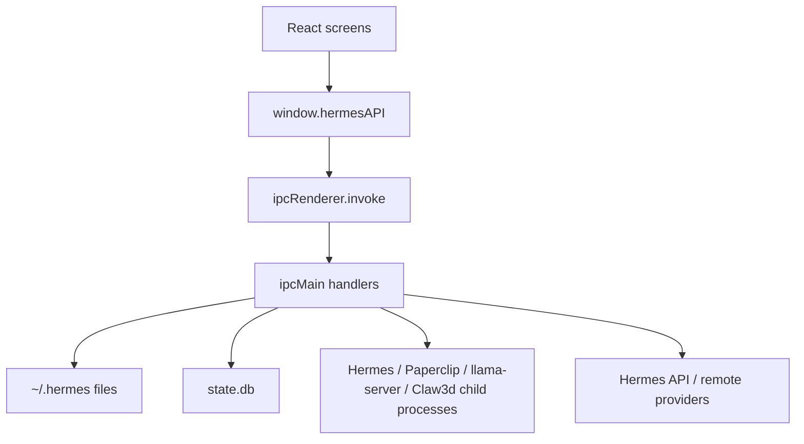

# Hermes Desktop Max - AI Review Pack

Generated from repository state on 2026-06-11. This condensed three-page pack is designed for another AI reviewer to reason about optimization, refactoring, patterns, and architecture without first reading the full 15-document reconstruction set.

## Page 1 - Project Overview

Hermes Desktop Max is an Electron + React desktop application for installing, configuring, and operating Hermes Agent. The desktop app owns GUI workflows, local process orchestration, profile/config editing, sessions UI, model registry, local model discovery, local GGUF launch, Paperclip, Claw3d/Hermes Office, schedules, tools, memory, and skills. Hermes Agent remains the backend brain and stores conversation state in SQLite under `~/.hermes`.

Core stack: Electron `39.8.5`, electron-vite `5.0.0`, Vite `7.3.1`, React `19.2.4`, TypeScript `5.9.3`, Tailwind `4.2.2`, better-sqlite3 `12.8.0`, Vitest `4.1.4`, electron-builder `26.8.1`.

High-level data flow:



Important trade-off: privileged work is centralized in the main process, which is easy to audit but has produced a large `src/main/app-main.ts` IPC registry. Renderer code is mostly separated from Node access by `src/preload/index.ts`.

Current local model decision: `/Users/Antman/Desktop/AI_Models` is the primary local model root. `/Volumes/MainStore/Development/AI_Models` remains as a fallback/external root. Local-file entries are sorted by configured root priority so Desktop GGUFs appear before MainStore entries.

## Page 2 - Key Code Walkthrough

### Preload Bridge Pattern

```ts
// src/preload/index.ts
const hermesAPI = {
  getModelConfig: (
    profile?: string,
  ): Promise<{ provider: string; model: string; baseUrl: string }> =>
    ipcRenderer.invoke("get-model-config", profile),

  setModelConfig: (
    provider: string,
    model: string,
    baseUrl: string,
    profile?: string,
  ): Promise<boolean> =>
    ipcRenderer.invoke("set-model-config", provider, model, baseUrl, profile),

  sendMessage: (
    message: string,
    profile?: string,
    resumeSessionId?: string,
    history?: Array<{ role: string; content: string }>,
    attachments?: Attachment[],
    contextFolder?: string,
  ): Promise<{ response: string; sessionId?: string }> =>
    ipcRenderer.invoke(
      "send-message",
      message,
      profile,
      resumeSessionId,
      history,
      attachments,
      contextFolder,
    ),
};
```

Intent: expose typed capabilities to React while keeping Node/Electron objects out of the renderer. Review concern: the bridge has grown broad and would benefit from runtime validation schemas per IPC channel.

### Local Model Discovery and Root Priority

```ts
// src/main/config.ts
export const DEFAULT_LOCAL_MODEL_ROOTS = [
  join(homedir(), "Desktop", "AI_Models"),
  "/Volumes/MainStore/Development/AI_Models",
];

// src/main/local-model-files.ts
function sortLocalModelsByRootPriority(
  models: SavedModel[],
  roots: string[],
): SavedModel[] {
  return models
    .map((entry, index) => ({ entry, index }))
    .sort((a, b) => {
      const aLocal = a.entry.source === "local-file";
      const bLocal = b.entry.source === "local-file";
      if (!aLocal || !bLocal) return a.index - b.index;

      const rootDelta =
        localRootRank(a.entry, roots) - localRootRank(b.entry, roots);
      if (rootDelta !== 0) return rootDelta;

      return (
        (a.entry.name || a.entry.model).localeCompare(
          b.entry.name || b.entry.model,
        ) || a.index - b.index
      );
    })
    .map(({ entry }) => entry);
}
```

Intent: keep local model entries stable while making the Desktop GGUF folder the primary/default model source. Review concern: model discovery uses synchronous recursive filesystem access; slow external volumes can block the main process.

### Safe Local GGUF Launch

```ts
// src/main/local-model-server.ts
export const LOCAL_MODEL_SERVER_PORT = 8080;
export const LOCAL_MODEL_SERVER_CONTEXT_SIZE = 16_384;

export function buildLlamaServerArgs(
  modelPath: string,
  port = LOCAL_MODEL_SERVER_PORT,
): string[] {
  return [
    "--model",
    modelPath,
    "--host",
    "127.0.0.1",
    "--port",
    String(port),
    "--alias",
    modelPath,
    "--ctx-size",
    String(LOCAL_MODEL_SERVER_CONTEXT_SIZE),
    "--no-warmup",
  ];
}
```

Intent: launch only GGUF files through an OpenAI-compatible local `llama-server` endpoint. Port selection starts at `8080` and searches through `8099`; the app rewrites model config to the actual returned base URL. Review concern: process lifecycle code is repeated across Paperclip, Claw3d, gateway, and local model launch.

### Direct Local Chat Path

```ts
// src/main/hermes.ts
export async function sendMessage(
  message: string,
  cb: ChatCallbacks,
  profile?: string,
  resumeSessionId?: string,
  history?: Array<{ role: string; content: string }>,
  attachments?: Attachment[],
  contextFolder?: string,
): Promise<ChatHandle> {
  ensureInitialized();

  const mc = getModelConfig(profile);
  if (!isRemoteMode() && shouldUseDirectLocalModelEndpoint(mc)) {
    return sendMessageViaDirectLocalModel(
      message,
      cb,
      profile,
      resumeSessionId,
      history,
      attachments,
      contextFolder,
    );
  }

  if (isRemoteMode()) {
    return sendMessageViaApi(
      message,
      cb,
      profile,
      resumeSessionId,
      history,
      attachments,
      contextFolder,
    );
  }

  // local gateway or CLI fallback follows...
}
```

Intent: avoid routing localhost OpenAI-compatible local model calls through the Hermes gateway when a direct call is safer and simpler. Review concern: direct local requests are non-streaming today, while gateway requests stream.

## Page 3 - Data Flow, Dependencies, Pain Points

Persistent state:

- `~/.hermes/config.yaml`: model/provider/tool configuration.
- `~/.hermes/.env`: provider keys and local gateway auth.
- `~/.hermes/desktop.json`: connection mode, SSH, Paperclip, local model roots.
- `~/.hermes/models.json`: saved/default/custom/local-file models.
- `~/.hermes/state.db`: Hermes Agent sessions/messages/tools/reasoning.
- `~/.hermes/profiles/<name>`: isolated profile homes.

Session read flow:

```ts
// src/main/sessions.ts
function getDb(readonly = true): Database.Database | null {
  const dbPath = activeStateDbPath();
  if (!existsSync(dbPath)) return null;
  return new Database(dbPath, readonly ? { readonly: true } : {});
}
```

The desktop reads Hermes Agent SQLite directly for sessions, messages, FTS search, reasoning/tool-call reconstruction, and attachment decoding. This is practical and fast, but it couples the app to the agent DB schema.

Current validated Desktop GGUF models:

- `DeepSeek-R1-Distill-Qwen-14B-Q4_K_M.gguf`
- `gemma-4-12b-it-Q4_K_M.gguf`
- `gemma-4-E4B-it-Q4_K_M.gguf`
- `Llama-3.2-3B-Instruct-Q4_K_M.gguf`
- `Phi-4-mini-instruct-Q4_K_M.gguf`
- `Qwen2.5-14B-Instruct-Q4_K_M.gguf`
- `Qwen3.5-4B-Q4_K_M.gguf`
- `Qwen3.5-9B-Q4_K_M.gguf`

Known pain points:

- `src/main/app-main.ts` is a large IPC registry and a change hotspot.
- Several modules implement similar child-process lifecycle patterns.
- Local model scanning is synchronous.
- Direct local model chat is non-streaming.
- The app reads an external SQLite schema it does not migrate.
- Some CI/release workflow names still need fork-specific validation before public release.
- `models.json` reconciliation is intentionally conservative, so dead local-file entries can accumulate until explicitly removed.

## Areas for Review

- Should the IPC bridge be split into domain modules with generated runtime validators?
- Should local model discovery move to an async worker or cached background scan?
- Should `llama-server`, Paperclip, Claw3d, and Hermes gateway share a common process manager abstraction?
- Should direct local model calls support streaming so local GGUF UX matches hosted/gateway chat?
- Should the desktop stop reading `state.db` directly and instead consume a formal Hermes Agent session API?
- Are there unused UI/icon/highlighting dependencies that can be consolidated to reduce bundle size?
- Should release automation produce checksums/SBOMs and verify `Hermes Desktop Max.app` naming across all jobs?
